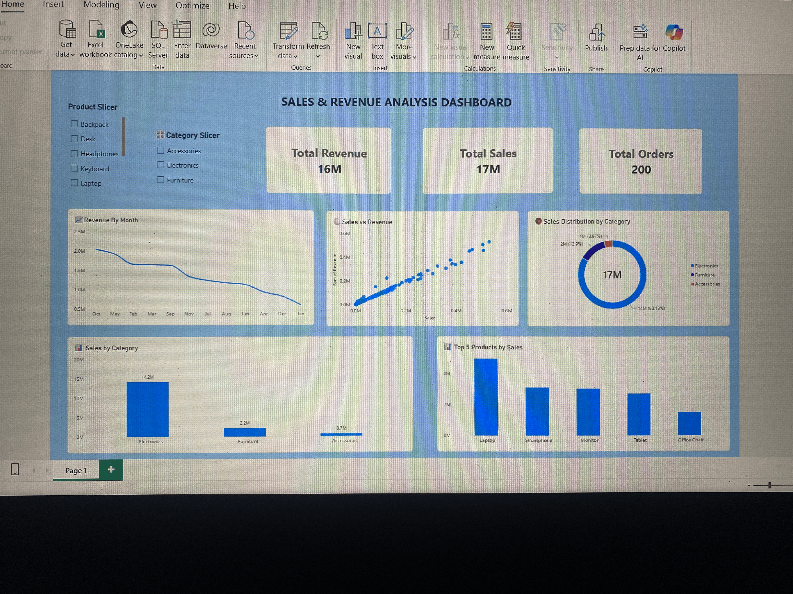

# Sales & Revenue Analysis Dashboard

## Project Overview
This Power BI dashboard analyzes sales, revenue, orders, products, and category performance using an interactive dataset.

## Features
- Total Revenue
- Total Sales
- Total Orders
- Revenue by Month
- Top 5 Products by Sales
- Sales by Category
- Sales Distribution by Category
- Sales vs Revenue Analysis
- Category & Product Filters

## Tools Used
- Power BI
- DAX
- CSV Dataset

## Dashboard Preview

